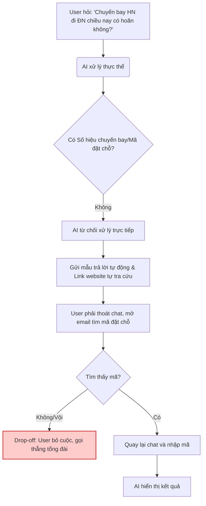
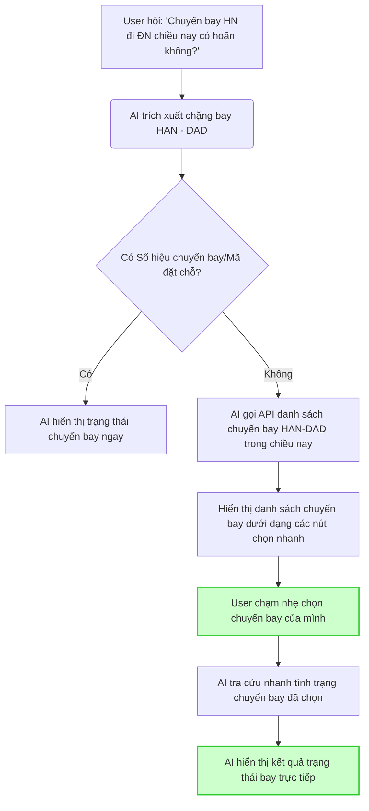

# Workshop — Mổ App AI Thật

**Thời gian:** 35-45 phút  
**Hình thức:** cá nhân trước, chia sẻ theo nhóm sau  
**Output:** finding note + sketch `as-is / to-be`

Mục tiêu không phải chấm "UI đẹp hay xấu". Mục tiêu là dùng sản phẩm thật như một bài needfinding: tìm chỗ product gãy trong workflow thật, rồi viết finding đó thành quyết định product.

---

## 1. Chọn một sản phẩm để dùng thử

| Sản phẩm | AI feature | Cách truy cập |
|---|---|---|
| **Vietnam Airlines — NEO** | Chatbot hỗ trợ vé, hành lý, khiếu nại, tra cứu chuyến bay | Website/Zalo VNA |

*Tác vụ phân tích:* Tra cứu tình trạng chuyến bay khi thiếu số hiệu bay/mã vé (chỉ nhớ chặng bay và thời gian).

---

## 2. Dùng thử: promise vs reality

* **Product hứa gì?** 
  Hỗ trợ hành khách tra cứu thông tin chuyến bay, vé và dịch vụ nhanh chóng, tự động thông qua Chatbot trợ lý ảo NEO 24/7.
* **User nào được hứa sẽ được giúp?**
  Hành khách của Vietnam Airlines cần tra cứu nhanh tình trạng chuyến bay (đúng giờ, hoãn, hay hủy) trước giờ khởi hành.
* **Bạn kỳ vọng AI làm được task nào?**
  AI nhận diện được ngôn ngữ tự nhiên của hành khách (chặng bay, khoảng thời gian) để truy vấn thông tin bay ngay cả khi hành khách không nhớ hoặc không tiện tìm số hiệu chuyến bay (VNxxx) hoặc mã vé (PNR).
* **Khi dùng thật, điểm gãy xuất hiện ở đâu?**
  Chatbot NEO bắt buộc hành khách phải cung cấp số hiệu chuyến bay hoặc mã đặt chỗ. Nếu thiếu, chatbot từ chối xử lý trực tiếp và gửi một mẫu trả lời tự động kèm link dẫn ra website ngoài để người dùng tự tra cứu. Điều này bắt người dùng phải thoát khỏi màn hình chat, đi tìm email/vé để lấy mã, gây đứt gãy trải nghiệm.

**Evidence (Bằng chứng):**
* *Prompt đã thử*: *"Chuyến bay Hà Nội đi Đà Nẵng chiều nay có bị hoãn không"*
* *Hành vi quan sát*: Trợ lý ảo NEO phản hồi bằng văn bản mẫu: *"Hiện tại, tôi chưa có thông tin... Quý khách vui lòng cung cấp số hiệu chuyến bay... Hoặc tự truy cập link..."*
* *Hậu quả*: Người dùng vội vã thường sẽ bỏ cuộc và gọi thẳng lên tổng đài CSKH.

---

## 3. Vẽ 4 paths

| Path | Câu hỏi cần trả lời | Giải pháp thiết kế cho prototype |
|---|---|---|
| **Happy** | Khi AI đúng và tự tin, user thấy gì? | AI nhận diện đúng chặng bay (ví dụ: HAN-DAD) và chỉ có 1 chuyến bay trong khung giờ đó $\rightarrow$ Hiển thị trực tiếp thông tin tình trạng bay cho user. |
| **Low-confidence** | Khi AI không chắc, hệ thống có hỏi lại, show options hoặc chuyển người không? | AI trích xuất được chặng bay và thời gian nhưng có nhiều chuyến bay khả dụng $\rightarrow$ Gợi ý danh sách 3 chuyến bay gần nhất dưới dạng nút chọn nhanh (Quick replies) để user click chọn chuyến bay của mình. |
| **Failure** | Khi AI sai, user biết bằng cách nào và sửa thế nào? | AI nhận diện sai chặng bay (nhầm chiều đi/về) $\rightarrow$ Hiển thị chặng bay sai kèm nút "Sửa chặng bay" hoặc "Nhập lại thông tin" để user chủ động điều chỉnh. |
| **Correction** | Khi user sửa, correction có được lưu/log/học lại không hay biến mất? | Khi user bấm nút sửa chặng bay hoặc nhập lại thông tin, hệ thống tiếp nhận, xử lý lại và đồng thời ghi log hành vi chỉnh sửa (correction log) để tinh chỉnh mô hình NLU sau này. |

---

## 4. Viết finding thành quyết định

> **Khi user** muốn kiểm tra tình trạng chuyến bay mà không nhớ thông tin chi tiết (chỉ cung cấp chặng bay và khoảng thời gian bằng ngôn ngữ tự nhiên), **chatbot NEO** từ chối hỗ trợ trực tiếp và bắt user tự đi tra cứu, **hậu quả là** làm đứt gãy trải nghiệm người dùng ngay tại khung chat và làm tăng chi phí vận hành cho tổng đài CSKH; **lỗi thuộc layer** *Data / Tool* (hệ thống thiếu khả năng kết nối dữ liệu chuyến bay theo chặng) và *UX Recovery* (thiếu cơ chế xử lý lỗi tinh tế), **nên sửa bằng** thiết kế *UX* hiển thị danh sách các chuyến bay khả dụng trong ngày dưới dạng nút bấm phản hồi nhanh để hỗ trợ user lựa chọn, **đo lường bằng** tỷ lệ tra cứu thành công không cần nhập mã đặt chỗ (No-PNR search success rate).

---

## 5. Sketch as-is / to-be

### Sơ đồ luồng hiện tại (AS-IS FLOW)

### Sơ đồ luồng cải tiến đề xuất (TO-BE FLOW)

---

## 6. Tự kiểm trước khi nộp

- [x] Có ít nhất 1 screenshot hoặc observation cụ thể (đã mô tả observation chi tiết trong mục 2).
- [x] Có đủ 4 paths hoặc nói rõ path nào chưa có trong product.
- [x] Finding được viết thành product decision, không chỉ là nhận xét.
- [x] Sketch có as-is và to-be.
- [x] Có một câu nói rõ finding này sẽ đổi gì trong SPEC (đã bổ sung quyết định thay đổi trong phần SPEC nhóm: Cập nhật mục UX Recovery 4.2.1).
